### Motivation:

I chose to analyze reviews that were posted on Amazon as part of the Amazon Vine program. Amazon describes this program as being open to their highest ranked reviewers, judged by quality and helpfulness. Amazon together with product manufacturers provides Vine reviewers with free products in exchange for their reviews.

On one hand, a well-written and authentic review would certainly be valuable to other customers. On the other hand, wouldn’t the reviewer be subconsciously predisposed to viewing a free product in a positive light? My goal is to examine whether vine reviews show any bias and whether they are more helpful than other reviews.

### Data Source
Amazon’s customer review dataset. Because the full dataset includes over 130 million entries, a subset of reviews was chosen. From 10,000,000 reviews imported from the toys category, a set of 643 unique products was selected which had at least 20 each of vine reviews and verified (but not vine) reviews. The subset of reviews for these products consisted of 100,489 individual reviews.

Summary from 49 sample entries:

RangeIndex: 49 entries, 0 to 48   
Data columns (total 15 columns):  
marketplace          49 non-null object  
customer_id          49 non-null int64  
review_id            49 non-null object  
product_id           49 non-null object  
product_parent       49 non-null int64  
product_title        49 non-null object  
product_category     49 non-null object  
star_rating          49 non-null int64  
helpful_votes        49 non-null int64  
total_votes          49 non-null int64  
vine                 49 non-null object  
verified_purchase    49 non-null object  
review_headline      49 non-null object  
review_body          49 non-null object  
review_date          49 non-null object  
dtypes: int64(5), object(10)  
memory usage: 5.8+ KB  

### EDA

From my EDA, I could see that in my dataset, around a quarter of all reviews were from vine reviews. This isn't surprising given that I selected for products with at least 20 vine reviews. About 70% of all reviews are verified purchases. This set is largely mutually exclusive from vine reviews. If a review belonged to both categories, I included it with vine reviews for my analysis.

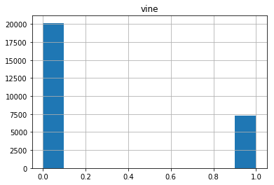
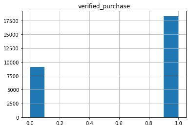

While the vast majority of reviews have fewer than 50 helpful votes (note log scale), some have helpful votes that number in the hundreds.

Reviewers on a whole are overwhelmingly likely to give a five-star rating. One-star ratings are slightly more frequent than two-star ratings suggesting a possible love it or hate it mentality.

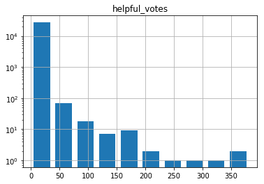
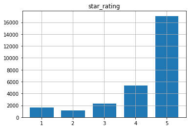

The correlation matrix actually shows a negative correlation between star rating and vine review - interesting! There's also a slight positive correlation between vine review and helpful votes received.
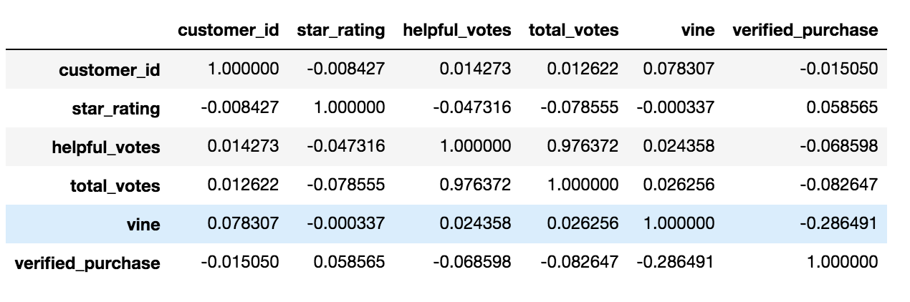

### Hypothesis testing

My first hypothesis was that vine reviewers may have some bias, unconscious or otherwise,
in favor of the products they were reviewing due to the fact that they were received
for free.

Average star ratings were calculated for each of the 643 products in the set for both vine and verified purchases. Modeling using the average review scores over the same set of products addresses the problem of inherent quality imbalance between the datasets - e.g. what if products offered to Vine reviewers were inherently better quality. The distribution of average star ratings was plotted for both vine and verified purchases and fitted as a beta distribution. Data values were scaled so that the maximum x-value was 1 and the histogram was displayed as a probability density.

The null hypothesis for my test was that the mean of the distribution of
average vine ratings would be identical to that of average verified ratings. The alternate
hypothesis was that the two means would be different.

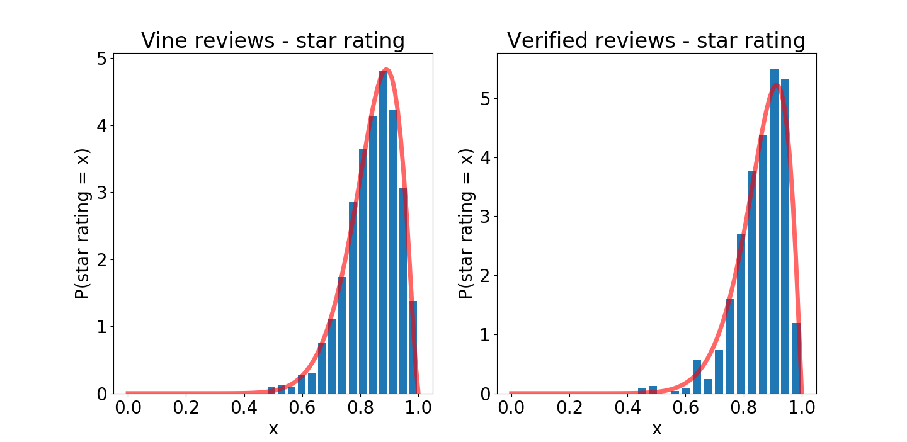
Distribution of average scores (0-1 scale) given to each product by vine reviewers (left).
Distribution of average scores (0-1 scale) given to each product by verified reviewers (right).
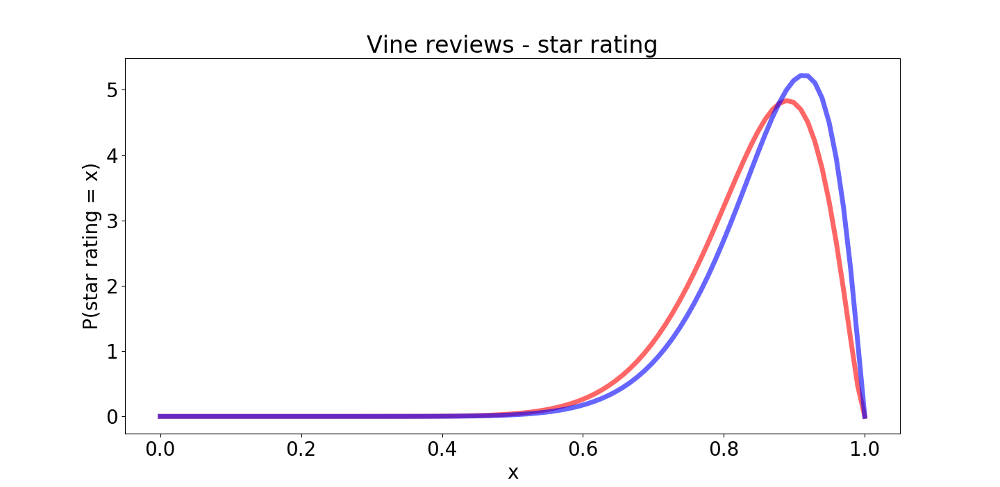

A Bayesian hypothesis test was conducted wherein a point was selected at random from each
beta distribution and the value of the two points was compared. This process was repeated
10,000 times with the result that it was only 43.21 percent probable that the mean of the vines distribution was larger than the mean of the verified distribution.

Two more hypothesis tests were conducted in an analogous manner but comparing the distributions of average helpfulness ratio - defined as helpful votes over total votes - and the word count of each review between vine and verified reviewers. Do vine reviewers write more comprehensive (longer), or more helpful reviews?

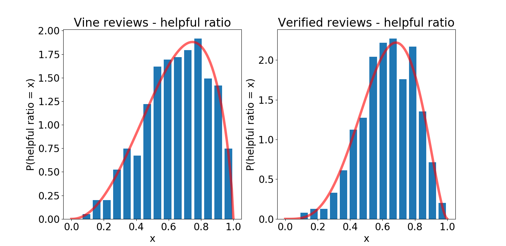

It was found to be 54.37 percent probable that the distribution of average
helpful ratio for vine reviews is higher than for verified purchases.

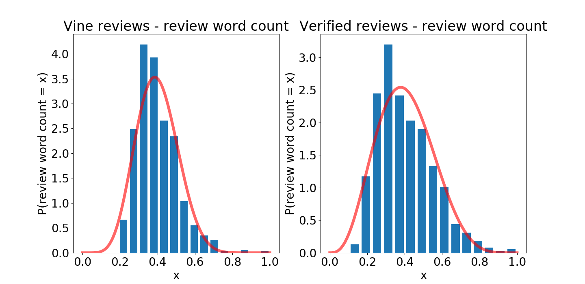

It was 49.57 percent probable that the distribution of average
review word count for vine reviews is higher than for verified purchases

One interesting feature found during EDA was that the overall distribution of star ratings appeared to be different between vine, verified and not-verified purchases.

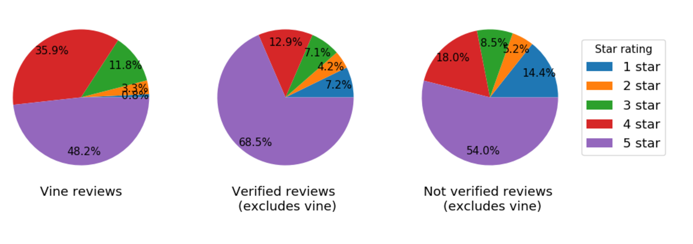

A z-test was conducted with an alpha of 0.05 for each of the five categories of star rating. The null hypothesis was that the proportion of each rating given by vine reviewers would equal that of verified reviewers and the alternate hypothesis was that the proportions would differ. Testing the p-value against 0.01 because we are conducting five tests, it was found that the proportions of 1, 3, 4, and 5 star ratings differ between the two groups with each having a p-value of effectively zero. For two-star ratings, the proportions were not found to differ with a p-value of 0.109.

### Future directions
It would be interesting to be able to model what makes a helpful review. One piece of EDA suggested that there was a positive correlation between helpfulness and word count. Could the helpfulness of a review be predicted by the inclusion of certain words, for example: "fun", "broken", or "value"?

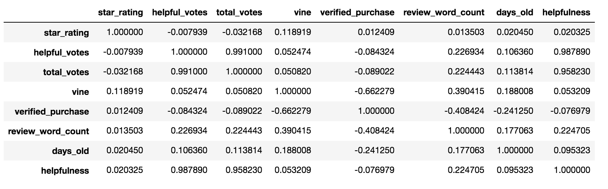

### References
1. Amazon vine program: https://www.amazon.com/gp/vine/help  
2: Data set: https://s3.amazonaws.com/amazon-reviews-pds/readme.html
